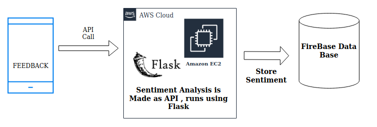

<h2>Feedback Analysis  </h2>

<h3> One of the  Features required by NGO : Capturing Relevant Insights from Feedback and making Dashboards.</h3>

<h3> Solution  We are Proposing : Developing our own Sentiment Analysis API which runs on AWS EC2 Instance </h3>

<h3> Overview </h3>

> Workflow

 

<h2> Extension </h2>

> We are Researching on how to tag entities and also improving the present API.