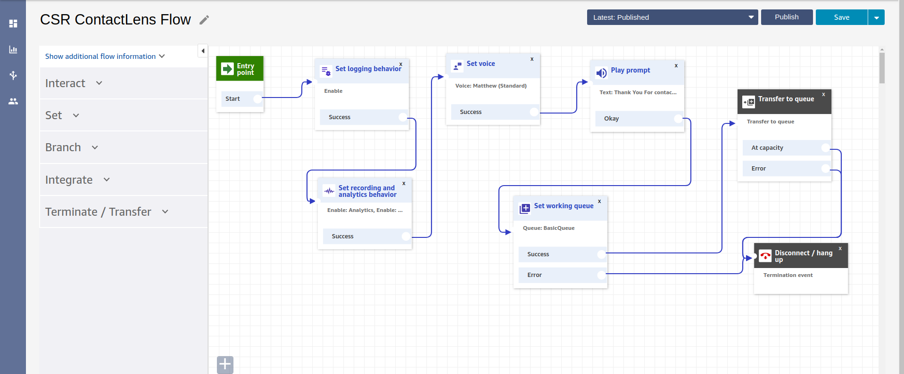
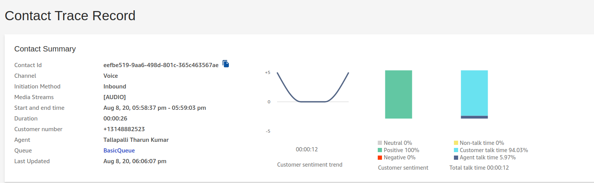

<h2>Voice Feedback Analysis using AWS </h2>

<h3> One of the  Features required by NGO : Gather IVR or Voice Based feedback from those without Internt Access </h3>

<h3> Solution  We are Proposing : Establishing Amazon Connect Contact centre and Adding Contact Lens( ML Capabilities )  to generate the analysis on voice feedback.

<h3> Overview </h3>

> Workflow

 

> Output

 

<h2> Extension </h2>

> We are Trying to Generate Separate dashboard In website , with out depending on AWS.